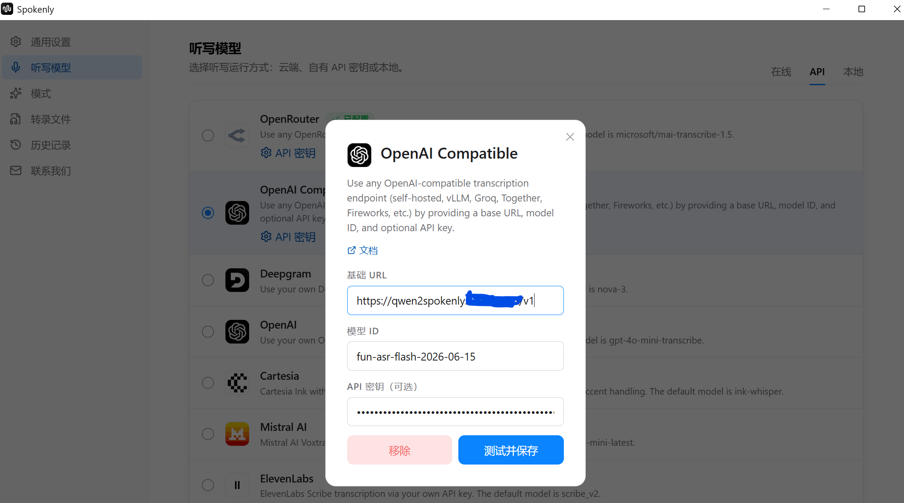

# Qwen2Spokenly - 百炼语音识别适配

<div align="center">



**将阿里云百炼 ASR 模型转换为 OpenAI Audio Transcriptions 兼容接口，供 Spokenly 调用。**

</div>

## ✅ 特性

- 🔄 **OpenAI 兼容**：将百炼 ASR 转换为 Spokenly 可调用的 OpenAI 兼容接口
- 🔑 **不保存密钥**：百炼 API Key 由 Spokenly 随请求传入

## 🚀 部署到 Cloudflare

1. **Fork 本仓库**：将项目 Fork 到自己的 GitHub 账号
2. **注册 Cloudflare 账号**：访问 [dash.cloudflare.com](https://dash.cloudflare.com/sign-up)
3. **连接部署**：
   - 进入 Cloudflare Dashboard → **Workers & Pages**
   - 点击 **Create application**，选择从 Git 仓库导入
   - 连接 GitHub，选择自己 Fork 的 `qwen2spokenly` 仓库
   - 部署命令填写 `npx wrangler deploy`，根目录保持仓库根目录
   - 保存并部署
4. **获取地址**：部署完成后得到类似下面的 Worker 地址：

```text
https://qwen2spokenly.<你的 workers.dev 子域名>.workers.dev
```

连接 GitHub 后，后续推送可以由 Cloudflare 自动触发重新部署。

> 💡 建议绑定自定义域名，便于长期使用和迁移。

## 📌 Spokenly 配置

在“听写模型 → OpenAI Compatible”中填写：

| 配置项 | 值 |
| --- | --- |
| 基础 URL | `https://qwen2spokenly.<你的 workers.dev 子域名>.workers.dev/v1` |
| 模型 ID | `fun-asr-flash-2026-06-15` |
| API 密钥 | 百炼 API Key |

基础 URL 只填写到 `/v1`。也可以将模型 ID 改为 `qwen3-asr-flash` 或 `qwen3-asr-flash:itn`。

## 🧪 本地开发

本地运行仅用于推送和部署前验证：

```powershell
wrangler dev
```

或双击 `start-dev.bat`，临时测试地址为 `http://127.0.0.1:8787/v1`。

## 📚 文档

- [使用手册](docs/usage.md)
- [技术方案](docs/architecture.md)
- [语音模型对比与个人选择](docs/asr-model-comparison.md)

## 🙏 致谢

- 本项目基于 [Linux.do：qwen3-asr-flash 的 Spokenly OpenAI 兼容方案](https://linux.do/t/topic/943798)修改，感谢原作者分享。
- `fun-asr-flash-2026-06-15` 适配参考[阿里云百炼非实时语音识别文档](https://help.aliyun.com/zh/model-studio/non-realtime-speech-recognition-user-guide)。
